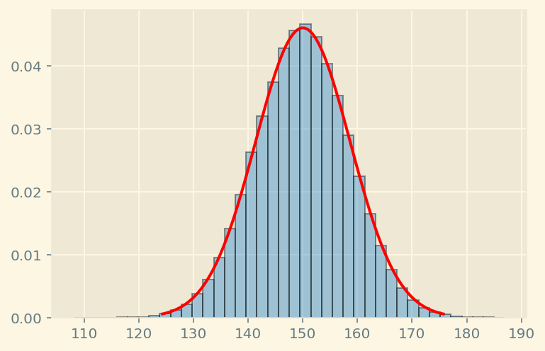
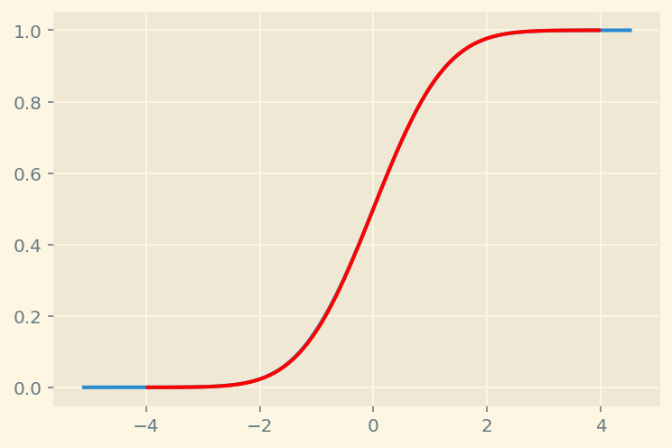
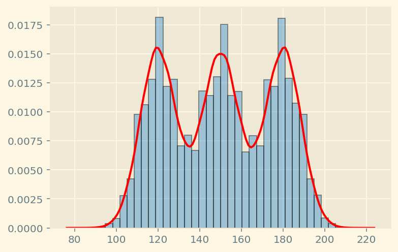
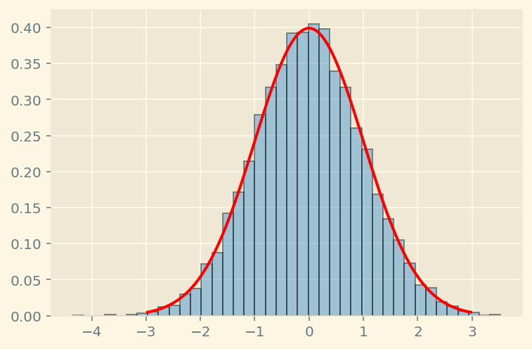
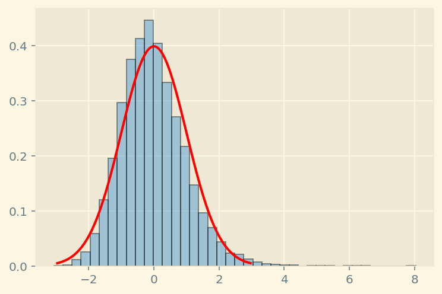
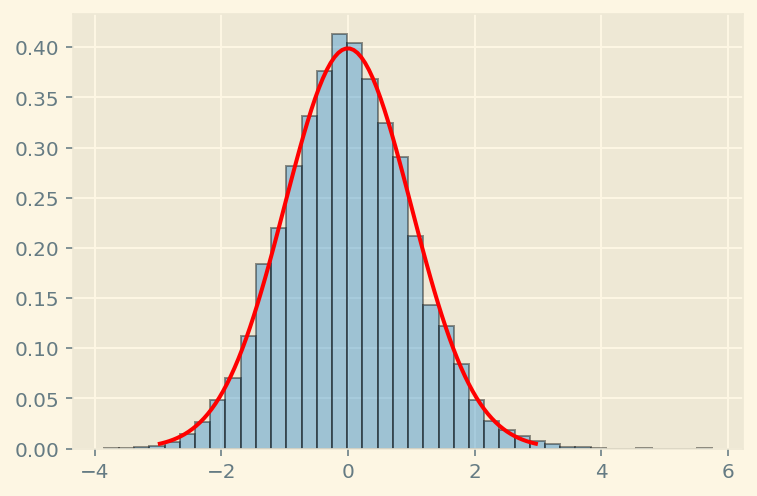
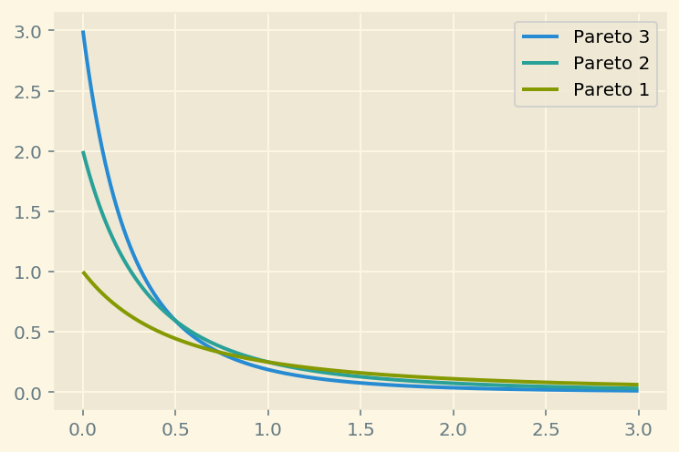

The Central Limit Theorem and its misuse
=========================

### Javier Rodríguez Chatruc, [Federico Carrone](https://federicocarrone.com/)

## Preliminaries

The Central Limit Theorem (CLT) is possibly the most famous theorem in all of
statistics, being widely used in any field that wants to infer something
or make predictions from gathered data. A first (simple) version of it
was introduced in the eighteenth century, first by de Moivre and then
later in a more refined way by Laplace, but it wasn\'t until around 1935
that the theorem as we know it today was published. The goal of these
notes is to explain in broad terms what it says and, more importantly,
what it *doesn\'t*.

Informally, the theorem states that if we take random samples of a
certain distribution and then average them, the result (i.e the *sample
mean*) will resemble a normal distribution the more samples we take.
More precisely, if $\{X_1,\dots,X_n,\dots\}$ are independent and
identically distributed (${i.i.d.}$) random variables and
$\overline{X_n} = \left(X_1+\dots+X_n\right)/n$ is the sample mean, its
standardization
$\dfrac{\overline{X_n} - E(\overline{X_n})}{\sqrt{Var(\overline{X_n})}}$
converges (in distribution) to a standard normal distribution $N(0,1)$.
Another way of saying this is that, as $n$ gets bigger, the
\"difference\" between the distribution of $\overline{X_n}$ and a normal
$N(E(\overline{X_n}),Var(\overline{X_n}))$ goes to zero. Note that
because the variables are ${i.i.d.}$, $E(\overline{X_n})$ is the same as the
expectation of any $X_i$, and $Var(\overline{X_n})$ the same as
$\frac{Var(X_i)}{n}$. By a simple calculation one can check that the
theorem holds just the same if we replace every instance of
$\overline{X_n}$ with the sums $S_n = X_1 + \dots + X_n$.

The most common example of the CLT in action is when considering a
binomial distribution. Say we flip a coin $n$ number of times and we
count the number of heads obtained; we can think of this as the sum of
$n$ independent random variables $X_i$ with a Bernoulli distribution,
$X_i \sim Be(1/2)$ (assuming the coin is fair). Then the CLT tells us
that as $n$ gets big, we can approximate the number of heads
$S_n = X_1 + \dots + X_n$ by a normal distribution with mean $n/2$ and
standard deviation $\sqrt{n/4}$. Let\'s see this in a simulation
with $n = 300$.

<figure>
<label for="img1" class="margin-toggle">⊕</label>
<input type="checkbox" id="img1" class="margin-toggle">
Normalized histogram in blue counting number of heads obtained after 300 tosses and in
red is the pdf of a normal distribution $N(150,75)$.

</figure>

<figure>
<label for="img2" class="margin-toggle">⊕</label>
<input type="checkbox" id="img2" class="margin-toggle">
Plot of the ecdf of the standardized number of heads in blue and cdf of a $N(0,1)$ random
variable in red.

</figure>

In the first figure, in blue is the normalized histogram counting the
frequency of the number of heads obtained after $300$ tosses; in red is
the probability density function (pdf) of a normal distribution
$N(150,75)$. The second figure shows a plot of the empirical cumulative
distribution function (ecdf) of the standardized number of heads in blue
and the cumulative distribution function (cdf) of a $N(0,1)$ random
variable in red. In general, comparing cdfs is more accurate
since histograms can differ wildly depending on the number of bins, and
the convergence of the CLT is stated in terms of the cdfs.

Note that in this particular case the CLT is telling us that, for any
$0<p<1$, a random variable $X$ with a binomial distribution
$X \sim Bi(n,p)$ can be approximated by a normal distribution
$N(np,np(1-p))$ provided $n$ is big enough. Do not be misled into
thinking that any distribution can be approximated by a normal one, this
is *not* what the theorem states. What it says is that the **sample
means** (or **sums**) of a (reasonable) distribution will be close to a
normal one. It just so happens that the sum of independent Bernoulli
random variables yields a binomial distribution.

## The three coins (non) example

Let\'s consider the following scenario: say we have three coins with
different *biases* (their probability of coming up heads): $0.4$, $0.5$
and $0.6$. We pick one of the three coins at random, toss it $300$ times
and count the number of heads. What is the distribution obtained? Is it
approximately normal?

As we have seen, if we fix the coin we\'re
tossing, the number of heads can effectively be approximated by a
distribution $N(300p,300p(1-p))$ (where $p$ is the coin\'s bias). This
time, however, each time we take a sample we might be tossing any of the
three different coins. A first idea might be that this should be a sort
of average of the three coins concentrated around $150$, resembling a
normal distribution. Let\'s see this in a simulation.

<figure>
<label for="img3" class="margin-toggle">⊕</label>
<input type="checkbox" id="img3" class="margin-toggle">
Distribution of picking one of the three coins at random and tossing it 300 times.

</figure>

In blue is a histogram counting the frequency of the number of heads
obtained. In red is the plot of a *Kernel density estimation* for this
distribution, an estimate for its pdf if the variable were continuous.
As the figure shows, this distribution has three peaks around the means
of the three coins ($120$, $150$ and $180$) and cannot be approximated
by a normal distribution. Remember, the CLT states that the *averages*
or *sums* of ${i.i.d.}$ random variables will resemble a normal distribution.
In the case where we\'re always flipping the same coin, these are the
sums of the Bernoulli variables adding $1$ with probability $p$ and $0$
otherwise. But in this case, depending on which coin we choose, the
random variables we\'re summing will be different, so the variable that
counts the number of heads in this experiment as a whole can\'t really
be written as a sum in the same way as before. Writing it as a certain
sum of random variables might be possible, but it will require
dependency between them, and the validity of the CLT when we introduce
dependence is much more restricted.

## Speed of convergence and fat tails

A question to answer regarding the CLT is how big we need $n$ to be. It
is important to understand that, mathematically, all the theorem is
saying is that *eventually* (i.e for $n$ big enough) the distribution of
the sample means will be close to normal. In practice, \'eventually\'
could mean an egregiously large $n$, one greater than the number of
samples we can possibly hope to take, which would render the CLT
useless. To address this possible issue, one usually studies the *speed
of convergence* of the sample means, that is, one gives an upper bound
on the error incurred when replacing the sample means with a normal
distribution. The **Berry-Esseen theorem** is a well known result in
this direction, which under certain conditions (namely, finiteness of
the third moment) tells us that the error is in the order of
$\frac{1}{\sqrt{n}}$.

Let\'s take a look at some examples on the speed of convergence. For
this we are going to use the *Kolmogorov-Smirnov* (K-S) test to measure how
close the sample means are to a normal distribution in different cases.
For our purposes, we don\'t need to know exactly how the test is
calculated, just that it gives a $p$-value ranging from $0$ to $1$, with
values close to $1$ meaning that we can\'t be too sure that the
distributions are different and close to $0$ being very confident they
are. Other tests exist for this purpose, namely the Anderson-Darling and
Cramér-von Mises tests, each with their pros and cons, but for our needs
one will suffice. We could also check that the Anderson-Darling test,
implemented in scipy, throws similar results as the ones we get.

<figure>
<label for="img4" class="margin-toggle">⊕</label>
<input type="checkbox" id="img4" class="margin-toggle">
Calculation of the Kolmogorov-Smirnov test for the (standardized) sample mean of a uniform distribution with n = 300.  
K-S test statistic = 0.00677 and $p$-value = 0.74774.

</figure>

<figure>
<label for="img5" class="margin-toggle">⊕</label>
<input type="checkbox" id="img5" class="margin-toggle">
Calculation of the K-S test for the sample mean of a Pareto type II distribution (sometimes referred to as Lomax) with parameters alpha = 3 and lambda = 1, n = 300.  
K-S test statistic=0.05074 and $p$-value = 8.62409e-23.

</figure>

<figure>
<label for="img6" class="margin-toggle">⊕</label>
<input type="checkbox" id="img6" class="margin-toggle">
Calculation of the K-S test as before but with n = 30000.  
K-S test statistic = 0.01932 and $p$-value = 0.00114.

</figure>

Notice how, when taking a sample size of $300$, the uniform distribution
gives a much higher $p$-value every time. On the other hand, when
increasing the size to $30000$, the Pareto distribution throws
$p$-values more comparable to those of the uniform. Note also that in
the case of the Pareto distributions the plots are shifted to the left
and there seems to be some empty space to the right. What\'s happening
is there are actual values to the right, they\'re just not very
frequent; this is because this distribution is fairly *fat-tailed*, that
is, the probability of getting extreme values (i.e values that deviate
heavily from the mean) is much larger than on a typical distribution, so
it takes more samples to balance those out when taking the average.

On this note, if a distribution is too fat-tailed, the CLT fails, which
is to say, the sample means will not eventually follow a normal
distribution. More concretely, this will happen if the distribution in
question has infinite variance; intuitively, this is because the
variations are so wild that no amount of samples will make the averages
stabilize around a certain value. This might seem like a fringe case,
but in certain disciplines where some variables are too volatile (like
finance), it\'s not completely unreasonable to expect infinite variance.
Even if one expects finite variance, its value might be so large that
the number of samples required to get a reasonable estimation through
the CLT is not feasible.

As a quick visualization of fat-tailedness, consider the following
simulation where we take a million samples of different Pareto
distributions and compute their maximum value attained and probability
of being greater than $100$, as well as plot their pdfs.

<figure>
<label for="img7" class="margin-toggle">⊕</label>
<input type="checkbox" id="img7" class="margin-toggle">
Pareto distribution (type II) pdf plots with parameters lambda = 1, alpha = 3,2,1.  
Pareto 3 maximum value: 140.3794 
Pareto 3 probability of > 100: 9.7059e-07  
Pareto 2 maximum value: 880.5030 
Pareto 2 probability of > 100: 9.8029e-05  
Pareto 1 maximum value: 26173612.9987 
Pareto 1 probability of > 100: 0.0099 

</figure>

We can see that the maximum values of the (type II) Pareto distributions
(and probabilities of being $>100$) increase as the parameter $\alpha$
decreases. In other words, extreme values become more likely, which can
be seen in their pdfs decaying more slowly. This is what is meant by
fat-tailedness, their pdf plots have fat tails. As a side note, the
distribution with $\alpha = 3$ has finite variance, while the other two do
not.

The idea of estimating the probability of high deviations from the mean
is encompassed in results like Chebyshev\'s inequality. These usually
give upper bounds on the probability $P(|X - \mu|>\varepsilon)$ for a
random variable $X$, $\mu$ its mean and arbitrary $\varepsilon$ (a
refined version is the Vysochanskij-Petunin inequality, giving a more
optimal bound on unimodal distributions). Note, however, that these
typically require finite variance and thus are not suited for very
fat-tailed distributions like the Pareto $1$ and $2$ we just saw (in
fact, the Pareto $1$ doesn\'t even have a mean). Tail behaviour in these
types of distributions might require a more case by case approach.

## Common misconceptions and final comments

Part of the reason why the normal distribution is so popular is because
it is somewhat well behaved. It is symmetric around the mean (which is
also its mode) and stable, meaning that linear combinations of normally
distributed random variables are again normally distributed. Also, at
the time when the CLT was first introduced there were no computers, so
calculations were very inefficient and restricted; because the values of
a normal distribution were tabulated, having normally distributed data
was very convenient. This led to it being ubiquitous, and even today
most introductory probability and statistics courses spend most of their
time covering the normal distribution.

When discussing the CLT at the beginning, we warned about the mistake of
approximating any distribution by a normal one. This is a very common
misconception, that if we take enough samples the distribution of
whatever it is we\'re studying will be (close to) normal. The amount of
time between earthquakes is usually modeled by an exponential
distribution. If we were to measure these times and then plot the
distribution obtained, the result will resemble an exponential
distribution, *not* a normal one, the more measurements we make (a
measurement here is the same as a sample). The distribution of the
**average** time between earthquakes, however, will be approximately
normal as the sample size increases. This is an important distinction.
The CLT is widely used because taking averages is a very common way to
study properties of nature or a population. For instance, if one is
interested in the proportion of individuals in a population satisfying a
certain condition (like having some disease or voting for a certain
candidate), one can think of this as a variable taking the value $1$ if
the condition is satisfied and $0$ if it\'s not. The sample means are
then the proportion we are looking for, so it is reasonable to model it
through a normal distribution with enough samples.
Just remember, not *everything* we study is an average.

Another frequent misconception is that the sample means are *actually*
normally distributed after taking enough samples. The normality
assumption seen throughout science is just an approximation, the only
way the sample means will be normally distributed is if the random
variable being sampled was already normal to begin with. This
approximation is useful because it simplifies things, but it is still
important to be mindful that it is not completely accurate.

Finally, most statistical models used in science start by (perhaps implicitly) assuming that the phenomenon in question follows a certain distribution, that is, the data collected is assumed to be sampled from a certain underlying distribution. The job, then, is to correctly estimate the parameters of that distribution to obtain the best fit. This is already a difficult task in and of itself, but sometimes it can be useful to remember the first assumption. It might not be that your parameter estimation is wrong, but rather that the underlying distribution is a different one. A common indicator that a normality assumption might be
incorrect is the presence of extreme outliers. We\'ve seen how
fat-tailedness is related to outliers being more likely, but in a
standard normal distribution, an absolute value of, say, more than $6$
is incredibly rare (approximately $1$ in $500.000.000$). Seeing an event
like this isn\'t impossible, but it is so unlikely that it can make you
reconsider whether your model fits.

Through Bayes\' theorem one can try
to answer the question of how reasonable the normality assumption is
after seeing such an event (see for example [this
post](https://www.johndcook.com/blog/2018/05/31/six-sigma-events/) by
John Cook for a good explanation of this). This idea of updating your
beliefs after an outcome is at the core of bayesian statistics and can
be a powerful tool in modeling, one that isn\'t as reliant in prior
assumptions.

## Bibliography

- [The Problem is Beyond Psychology: The Real World is More Random than Regression Analyses](https://papers.ssrn.com/sol3/Delivery.cfm/SSRN_ID1941792_code475810.pdf) - Nassim Nicholas Taleb, Daniel G. Goldstein

- [Probability, Risk, and Extremes](https://fooledbyrandomness.com/DarwinCollege.pdf) - Nassim Nicholas Taleb

- [Cauchy distribution parameter estimation](https://www.johndcook.com/blog/cauchy_estimation/) - John D. Cook

- [Rolling dice for normal samples](https://www.johndcook.com/blog/2009/02/10/rolling-dice-for-normal-samples/) - John D. Cook
